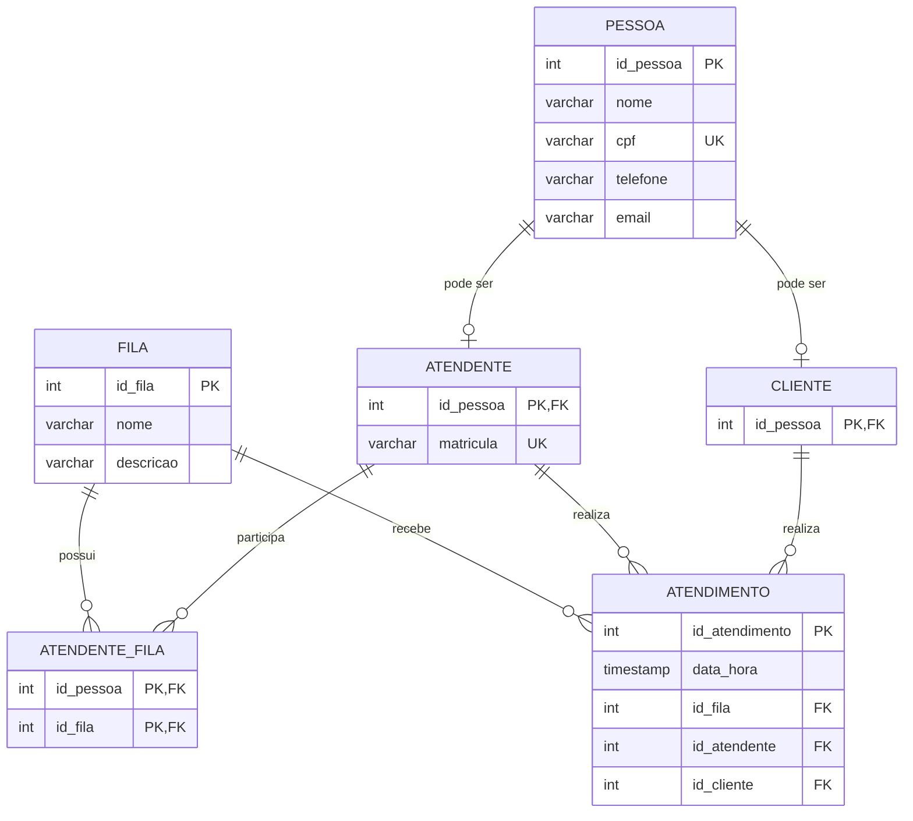

# Sistema de Atendimento

## 1. Apresentação do Projeto

O Sistema de Atendimento foi desenvolvido para uma empresa que precisa gerenciar o registro e o fluxo de atendimentos, permitindo o controle de clientes, atendentes, filas e atendimentos realizados.

O sistema foi projetado para organizar as informações relacionadas aos atendimentos e facilitar o gerenciamento do fluxo de clientes dentro da empresa.

## 2. Tema

Sistema de Atendimento.

## 3. Objetivo Geral

Implementar um sistema para uma empresa que precisa gerenciar o registro e o fluxo de atendimentos, controlando filas, atendentes e clientes.

## 4. Público-Alvo

O sistema é destinado a empresas que realizam atendimentos e precisam organizar o fluxo de clientes, filas e atendentes.

## 5. Modelo Relacional

O modelo relacional representa as entidades do sistema, seus atributos e os relacionamentos existentes entre elas.

## 6. Entidades

### Pessoa

Armazena os dados básicos das pessoas cadastradas no sistema.

### Atendente

Representa as pessoas que atuam como atendentes no sistema.

### Cliente

Representa as pessoas que utilizam o serviço de atendimento.

### Fila

Representa as diferentes filas de atendimento da empresa.

### Atendente_Fila

Relaciona os atendentes às filas em que eles atuam.

### Atendimento

Registra cada atendimento realizado, incluindo a data e hora, a fila, o atendente e o cliente.

## 7. Relacionamentos

Uma pessoa pode ser atendente, cliente ou ambos.

Um atendente pode participar de várias filas.

Uma fila pode possuir vários atendentes.

Um cliente pode possuir vários atendimentos.

Um atendente pode realizar vários atendimentos.

Uma fila pode receber vários atendimentos.
