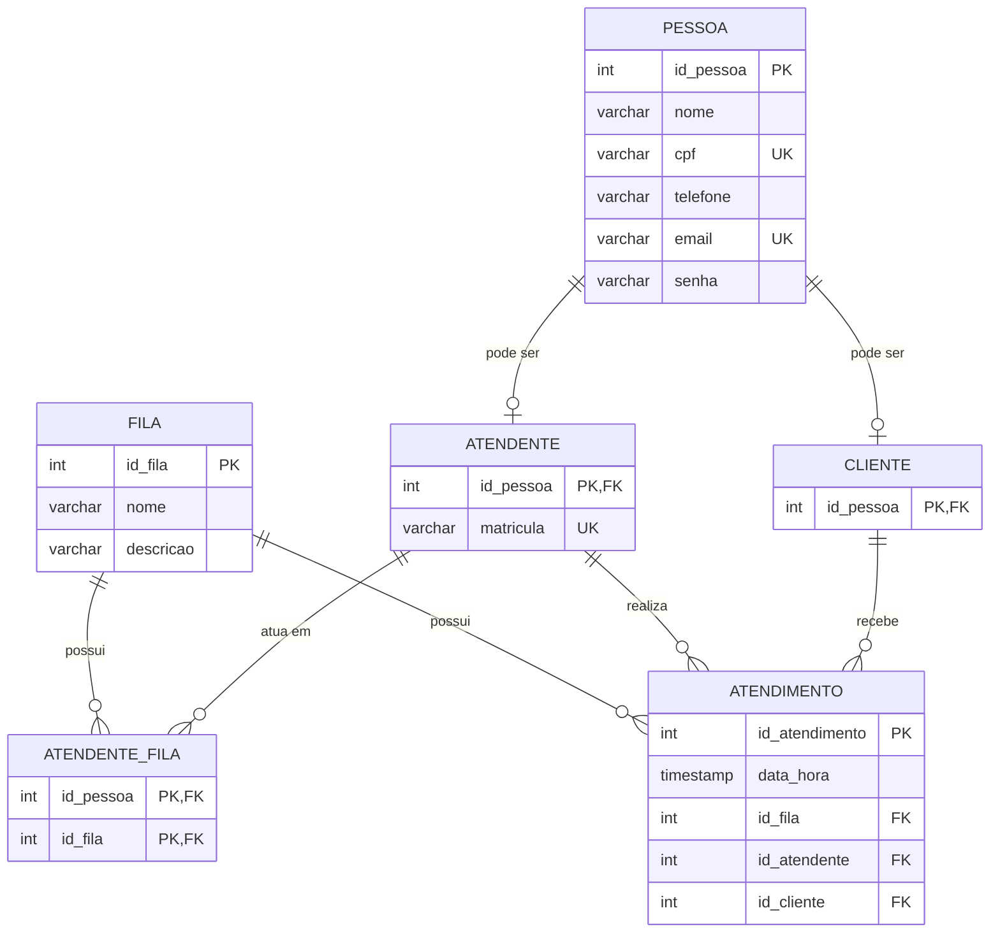

# Sistema de Atendimento

## 1. Apresentação do Projeto

O Sistema de Atendimento foi desenvolvido para uma loja de equipamentos eletrônicos que precisa organizar o atendimento aos seus clientes.

O sistema permite cadastrar pessoas como clientes ou atendentes, organizar as filas de atendimento e registrar os atendimentos realizados. Também possui cadastro e login de usuários e uma proposta de Dashboard de Atendimento para visualizar informações dos atendimentos realizados.

## 2. Tema

Sistema de Atendimento.

## 3. Objetivo Geral

Desenvolver um banco de dados para uma loja de equipamentos eletrônicos, permitindo organizar clientes, atendentes, filas e atendimentos.

Além disso, o projeto utiliza os dados registrados para gerar informações que ajudam a acompanhar os atendimentos, como a quantidade de atendimentos por fila, por atendente e por dia.

## 4. Público-Alvo

O sistema é destinado a lojas de equipamentos eletrônicos que precisam organizar o atendimento aos clientes e o trabalho dos atendentes.

## 5. Modelo Relacional

O modelo relacional apresenta as tabelas utilizadas no sistema, seus atributos e os relacionamentos entre elas.

## 6. Entidades

### Pessoa

Guarda os dados das pessoas cadastradas no sistema, como nome, CPF, telefone, e-mail e senha.

O e-mail é obrigatório e não pode ser repetido, pois é utilizado para o login. O CPF pode ficar vazio no cadastro.

### Atendente

Representa os funcionários que realizam os atendimentos.

A matrícula identifica o atendente, mas pode ficar vazia no cadastro feito pelo sistema.

### Cliente

Representa os clientes da loja que utilizam o serviço de atendimento.

### Fila

Representa os tipos de atendimento disponíveis na loja.

Atualmente, o sistema possui as filas:

* Vendas;
* Suporte Técnico;
* Financeiro;
* Trocas e Garantias.

### Atendente_Fila

Relaciona os atendentes às filas em que eles podem atuar.

Um atendente pode participar de mais de uma fila.

### Atendimento

Registra os atendimentos realizados, armazenando a data e hora, a fila, o atendente e o cliente.

Esses dados também são utilizados nas consultas do Dashboard de Atendimento.

## 7. Relacionamentos

Uma pessoa pode ser cadastrada como atendente, cliente ou ambos.

Um atendente pode atuar em várias filas e uma fila pode ter vários atendentes.

Um cliente pode ter vários atendimentos.

Um atendente pode realizar vários atendimentos.

Uma fila pode receber vários atendimentos.

## 8. Cadastro e Login

O projeto possui telas de cadastro e login no protótipo.

No cadastro, o usuário informa nome, e-mail, senha, confirmação da senha e escolhe se sua conta será de atendente ou cliente.

O e-mail é utilizado para realizar o login e não pode ser repetido no banco de dados.

A senha é armazenada na tabela `pessoa`, enquanto o tipo de conta é definido pelo relacionamento com `atendente` ou `cliente`.

## 9. Inteligência de Dados

A inovação escolhida para o projeto é a **Inteligência de Dados**.

Os dados dos atendimentos são utilizados para gerar informações sobre o funcionamento do atendimento da loja.

Entre as informações que podem ser consultadas estão:

* Total de atendimentos;
* Atendimentos por fila;
* Atendimentos por atendente;
* Atendimentos por dia;
* Atendimentos mais recentes.

Essas consultas fazem parte da proposta do Dashboard de Atendimento.

## 10. Protótipo

O projeto possui um protótipo desenvolvido em HTML e CSS, com telas de cadastro, login e página principal.

O protótipo representa como o sistema poderia ser utilizado pelos clientes e atendentes da loja.

Os scripts SQL também possuem testes relacionados ao cadastro e login, verificando o cadastro de novos usuários, o acesso com e-mail e senha e a restrição de e-mails repetidos.
